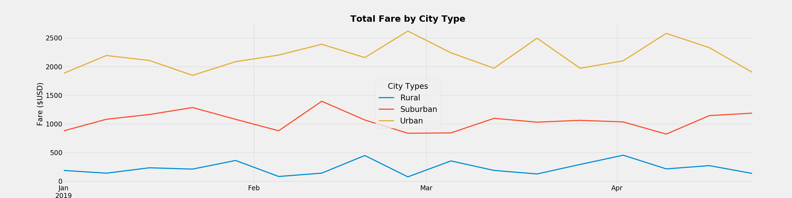

# PyBer Analysis Report

## Summary
PyBer is expanding business rapidly across several cities. This report will analyse the consistency of the expansion for the three different city types where PyBer is present.

The city and driver data for 2019 were deeply analysed and statistical models were generated to each Urban, Suburban and Rural cities based on the number of rides, number of drivers and the fares collected. 

The tabel below represents the summary of the findings per city type.

From the table, we can come up with two main findings:

* Not surprisingly the number of rides and drivers for Urban cities is disproportionately higher than the other city types, specially the rural cities, what leads to higher total fares during the 2019 data.
* Surprisingly, the average fare per ride and per driver is higher than the other city types.

Looking at the period of time from Jan to Apr 2019, as the graph shows below, there is a consistency on the total fares and per association the number of rides during the period.

## Analysis Review
From the analysis there are two lessons learned that were particularly important and that will have a great impact from now on.

* It is extremely hard to keep track of all the necessary lists and dataframes created in order to achieve the statistical analysis.
* Create meaningful and comprehensive graphs is a very time consuming, and I would argue that it is the most time-consuming task of all.

To overcome the situation above, the most important habit that I acquired is to keep a notebook on my side to track the list and dataframes created and the correlation between then. This allows me to exercise visualization of the entire process. Unfortunately, for now, I could find another alternative to speed the process of creating graphs other than copy&paste from previous work.

## Recommendations
From the summary of finding reported above, there are two recommendations:

* The number of drivers on the urban cities is concerning. The data shows that there were 1625 rides in 2019 and at the same time there were 2405 drivers, what means that not every driver was able to make a ride during the year. The number of drivers should be kept at the same level while the higher investments on marketing to increase the number of rides.

* The number of drivers on the rural cities is low. In order to explore terrain on areas where the average fare per ride is higher will lead to increased income

After reviewing the analysis, there is room to expand the analysis and it would be great if the data for the following areas:

* Ride distance 
    * Each ride goes from point A to point B, the distance between each point would help understand why the rural rides have higher fares that the other cities and it would help to allocate drivers in most valuable areas.

* Correlation between rides and special events
    * A better understanding of special events for different cities (holidays, shows/concerts, public transit disruption, late night rides, etc) will help drivers to be ready at the most valuable times.
